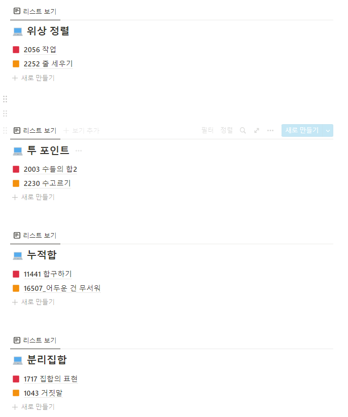

# baekjoon

- https://www.acmicpc.net/
- 알고리즘 역량 강화를 위해 백준 사이트를 통해 학습합니다.
- 주로 알고리즘 스터디를 통해 진행하고 개인학습도 병행합니다.

---

### 아이고리즈음

- 알고리즘 스터디를 진행합니다.
- 노션에 각자 코드를 업로드 후 매주 1회 코드 리뷰를 진행합니다.
- 스터디장 : 김가흔
- 스터디원 : 강민재, 금동운, 박준영, 이동근, 장창완
- 다양한 풀이법을 접하고, 팁을 공유하며, 혼자서는 생각하지 못했던 좋은 코드들을 서로 배우며 성장합니다.

---

### 01_IM

- SW 역량 테스트 IM등급 대비 스터디 입니다.
- 2022.02.14 ~ 2022.02.28
- 
- 

- 

---

### 02_A ~ 04_A

- 모의 SW 역량 테스트 A, A+등급 대비 스터디 입니다.
- 
- 
- 
- 
- 
- 
- 

