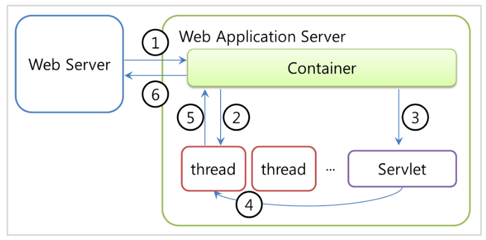

# WS_WAS

- [웹 서버와 웹 어플리케이션의 차이](https://studium-anywhere.tistory.com/19)
- [웹 서버와 웹 어플리케이션 서버의 차이 - 논리적 코딩](https://logical-code.tistory.com/30)
- WS
  - 웹 서버
  - Web Server
- WAS
  - 웹 어플리케이션 서버
  - Web Application Server

---

### Static_Dynamic

- Static
  - 정적인
  - 만들어 놓은 것 그대로 제공하는 것
  - HTML 템플릿 그대로 정적인 페이지, 정적인 웹사이트
- Dynamic
  - 동적인
  - 상호작용을 통한 데이터 처리가 필요한 경우 동적인 페이지라 한다.
  - 서버가 사용자의 요청(Request)에 따라 데이터를 가공처리한 뒤에 생성되어진 웹 페이지를 보여줌

---

### 웹 서버(Web Server)

- 정적인 컨텐츠를 제공합니다.
- 클라이언트가 요청한 정적인 컨텐츠를 HTTP를 통해 제공해주는 서버입니다.
- 웹 서버의 종류에는 NGINX. APACHE 등이 있습니다.
- 동적인 요청(ex. 데이터베이스 쿼리문 처리)이 들어오면 웹 서버에서 컨테이너(Container)에 보내준다.
- 웹 서버 혼자만은 동적 처리가 불가능하여 요청을 통해 데이터를 가져오거나 저장해야한다.
- 

---

### 서블릿(Servlet)

- [서블릿(Servlet)이란?](https://velog.io/@falling_star3/Tomcat-%EC%84%9C%EB%B8%94%EB%A6%BFServlet%EC%9D%B4%EB%9E%80)
- 동적 웹 페이지를 만들 때 사용되는 자바 기반의 웹 애플리케이션 프로그래밍 기술이다.
- 웹 요청과 응답의 흐름을 간단한 메서드 호출만으로 체계적으로 다룰 수 있게 해준다.
- 서버에서 실행되다가 웹 브라우저에서 요청을 하면 해당 기능을 수행한 후 웹 브라우저에 결과를 전송한다.
- ex) 로그인 시도를 할 때, 서버가 클라이언트에서 입력되는 아이디와 비밀번호를 확인하고 결과를 응답

---

### 서블릿 컨테이너

- 구현되어 있는 서블릿(Servlet) 클래스의 규칙에 맞게 서블릿을 담고 관리해주는 컨테이너이다.
- 클라이언트에서 요청을 하면 컨테이너는 HttpServletRequest, HttpServletResponse 두 객체를 생성하여 post, get 여부에 따라 동적인 페이지를 생성하여 응답을 보낸다.

---

### 웹 어플리케이션 서버

- WAS : Web Application Server
- 웹 서버로부터 오는 동적인 요청을 처리하는 서버를 웹 어플리케이션 서버라 한다.
- 인터넷 상의 HTTP를 통해 사용자 컴퓨터나 장치에 어플리케이션을 수행해주는 미들웨어로 볼 수 있다. 
- WAS는 웹서버 + 컨테이너로 이루어진 서버
- 웹 어플리케이션의 종류는 아파치 톰캣, 제우스, 제티(Jetty), 레진(Resin) 등이 있다.