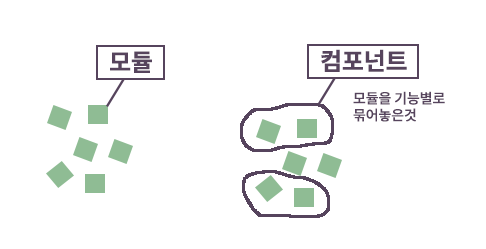

# 아키텍처

- [SW 아키텍처](https://moo-you.tistory.com/218)

---

### SW 아키텍처

- 개념적 의미
  - 여러 가지 소프트웨어 구성요소와 그 구성요소가 가진 특성 중 외부에 드러나는 특성
  - 구성 요소 간의 관계를 표현하는 시스템 구조나 구조체
- 지침, 원칙, 요소간의 관계, 구조

---

### 모듈, 컴포넌트

- 모듈
  - 작은 기능 하나하나의 단위
- 컴포넌트
  - 모듈을 기능별로 묶어 놓은 것
- 

---

### SW 아키텍처 설계 기본 원리

- 모듈화
  - 소프트웨어 성능 향상 및 유지관리 등이 용이하도록 시스템의 기능을 모듈단위로 나누는 것
- 추상화
  - 전체적이고 포괄적인 개념을 설계한 후에 구체화시켜 나가는 것
- 단계적 분해
  - 상위 개념부터 하위 개념으로 구체화 시키는 분할 기법, 하향식 설계 전략
- 정보은닉
  - 모듈 내부에 정보와 자료들을 숨겨서 다른 모듈이 접근하거나 수정 못하도록 하는 기법
- 오류, 리스크, 비용 최소화 방향으로 설계
- 재사용성 용이하게 설계
- 이해관계자 정의
- 요구사항 정의
  - 기능
  - 비기능

---

