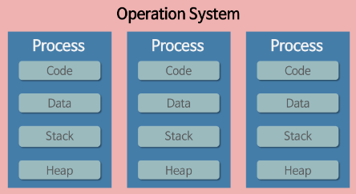
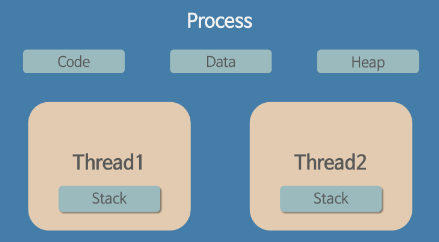

# 프로세스_스레드

- [프로세스와 스레드의 차이](https://gmlwjd9405.github.io/2018/09/14/process-vs-thread.html)
- [프로세스는 뭐고 스레드는 뭔가요?](https://www.youtube.com/watch?v=iks_Xb9DtTM&list=PLpO7kx5DnyIExYt0jkyWWjx8XNA2Fx2rI&index=6)

---

### 프로그램

- Program
- 어떤 작업을 위해 실행할 수 있는 파일

---

### 프로세스

- Process
- 컴퓨터에서 연속적으로 실행되고 있는 컴퓨터 프로그램
- 메모리에 올라와 실행되고 있는 프로그램의 인스턴스(독립적인 개체)
- 운영체제로부터 시스템 자원을 할당받는 작업의 단위
- 실행된 프로그램

---

### 프로세스 특징

- 
- 프로세스는 각각 독립된 메모리영역(코드, 데이터, 스텍, 힙)을 할당 받는다.
- 기본적으로 프로세스당 최소 1개의 스레드(메인 스레드)를 가지고 있다.

---

### 스레드

- Thread
- 프로세스 내에서 실행되는 여러 흐름의 단위
- 프로세스의 특정한 수행 경로
- 프로세스가 할당받은 자원을 이용하는 실행의 단위

---

### 스레드 특징

- 
- 스레드는 프로세스 내에서 각각 스텍만 따로 할당받고 코드, 데이터, 힙 영역은 공유한다.
- 스레드는 한 프로세스 내에서 동작되는 여러 실행의 흐름이다.
- 프로세스 내의 주소 공간이나 자원들을 같은 프로세스 내에 스레드끼리 공유하면서 실행된다.

