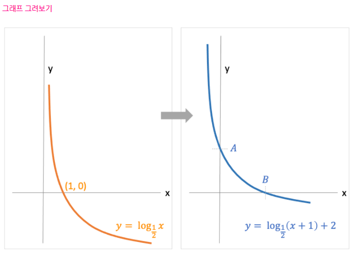
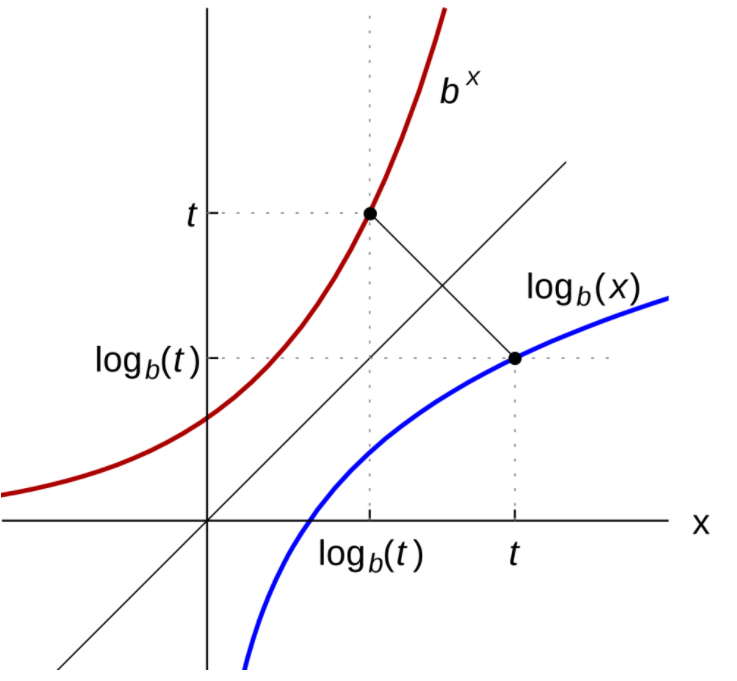

# 논리와 증명 / 수와 표현

- 명제

  - 항진명제

  - 명제의 간소화

- 증명

  

---

### 명제

- 항진명제 : 어떠한 명제가 있을때, 그것이 항상 참인 명제인지 진리표를 통해 확인해 보자

  - ( ~p ^ q ) V ( p V ~q )

    |  p   |  q   | ~p ^ q | p V ~q | ( ~p ^ q ) V ( p V ~q ) |
    | :--: | :--: | :----: | :----: | :---------------------: |
    |  T   |  T   |   F    |   T    |            T            |
    |  T   |  F   |   F    |   T    |            T            |
    |  F   |  T   |   T    |   F    |            T            |
    |  F   |  F   |   F    |   T    |            T            |

  - 진리표의 가장 우측열 결과를 통해 알 수 있듯이 해당 명제는 항상 참인 항진명제이다.

  

- 명제의 간소화

  - ( p ^ q ) V ( p ^ ~q )

    |  p   |  q   | p ^ q | p ^ ~q | ( p ^ q ) V ( p ^ ~q ) |
    | :--: | :--: | :---: | :----: | :--------------------: |
    |  T   |  T   |   T   |   F    |           T            |
    |  T   |  F   |   F   |   T    |           T            |
    |  F   |  T   |   F   |   F    |           F            |
    |  F   |  F   |   F   |   F    |           F            |

  - 진리표를 통해 p가 T이면 전체 명제도 T이고 p가 F이면 전체 명제도 F임을 알 수 있다

  - 이를 통해 전체 명제를 p로 간소화 할 수 있다.

  

---

### 증명

- 정의역

  - x^2 > = x 해당 명제는 x의 정의역에 따라 결과가 달라진다.

    - x가 실수일때, 해당명제는 -1 < x <1 의 영역에서 반례가 존재한다.
    - x가 정수일때, 반례가 존재하지 않는다.

  

- 짝수 홀수

  - n이 홀수이면 3n+7이 짝수임을 증명하라
    - n = 2k - 1
    - 3n+7 = 3 * ( 2k - 1 ) + 7
    - 3n+7 = 6k + 4
    - 3n+7 = 2 * ( 3k + 2 )
    - 3n+7 이 2 * 어떤정수 의 꼴로 나타낼 수 있으므로 항상 짝수이다.

  

- 3의 배수
  - 자연수 n에 대하여 n^2이 3의 배수이면 n이 3의 배수임을 증명하라
    - 대우를 증명해보자
    - n이 3의 배수가 아니면, n^2이 3의 배수가 아니다. 
      - n = 3k +1 이면
        - n^2 = 9k^2 + 6k + 1
        - n^2 = 3 * ( 3k^2 +2k ) + 1
        - n^2 = 3*m +1 이므로 3의 배수가 아니다.
      - n = 3k +2 이면
        - n^2 = 9k^2 +12k +4
        - n^2 = 3 * ( 3k^2 + 4k + 1 ) + 1
        - n^2 = 3 * m + 1 이므로 3의 배수가 아니다.

  

- 귀류법

  - 유리수와 무리수의 합은 무리수임을 증명하라

    - 유리수와 무리수의 합이 유리수라고 가정하고 모순을 찾자!
    - a : 유리수 , b : 무리수, c : 유리수
    - a + b = c
    - b = c - a
    - b = 유리수 - 유리수
    - b = 유리수  즉, 모순이 생긴다.
    - 가정이 모순이므로 유리수와 무리수의 합은 무리수이다.

  

- 귀납법

  - P(1), P(n) -> P(n+1)
    - P(1)이 성립함을 보이고
    - P(n)이 T라고 가정했을때, P(n+1)이 T가됨을 보여서 증명한다.
    - 또는, P(n-1)이 T라고 가정했을때, P(n)이 T가됨을 보여서 증명한다.
  - 1 + 2 + 3 + ••• + n = n * ( n + 1 ) / 2 임을 증명하라
    - n = 1 일때
      - 1 * 2 / 2  = 1
    - P(n-1) = (n-1)*n /2 이 옳다고 가정
      - P(n) = n + P(n-1)
      - P(n) = n +(n-1)*n/2
      - P(n) = ( 2n + n^2 - n ) / 2
      - P(n) = ( n^2 + n ) / 2
      - P(n) = n * ( n + 1 ) / 2

  

---

### 수와 표현

- 비트

  - k비트 -> 0 ~ 2^k - 1
  - 어떤값 n, 몇개의 비트?
  
    - 2^k - 1 >= n
    - k >= log(n+1)   #거의 log(n)
    - x = log(n) or 2^x = n
  

  

- 경우의 수 

  - 스무고개

    - yes or no 20번
    - 2^20 가지 

  

- 로그함수 그래프 그리기 이미지

  

- 로그함수 역함수 이미지

  
