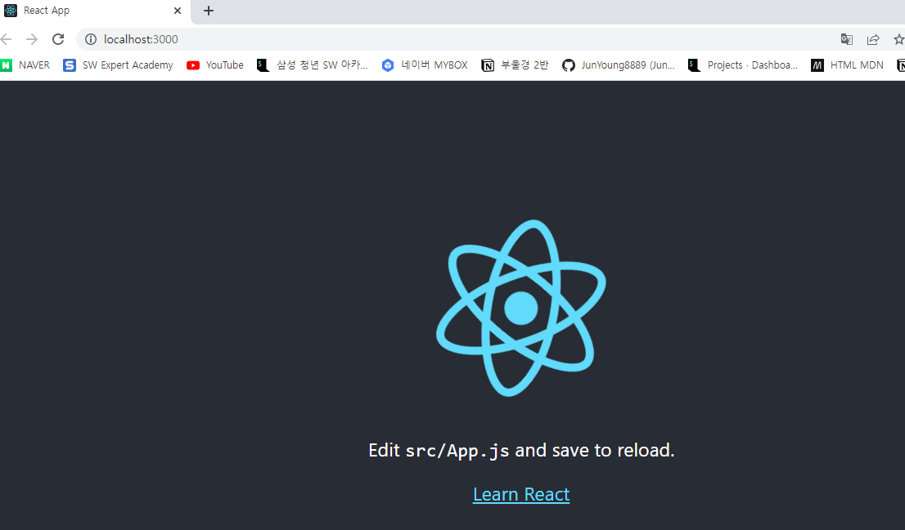

# React

- [2022 코딩애플 리액트 강의](https://www.youtube.com/playlist?list=PLfLgtT94nNq0qTRunX9OEmUzQv4lI4pnP)
- React
- react-router-dom
- redux/toolkit
- styled-components
- 프로젝트
  - 1 블로그
  - 2 쇼핑몰

---

### React 장점

- SPA (Single Page Application)
- component로 html 재사용 편리
- 데이터가 html에 자동 반영됨
- 사용량 1위

---

### MPA vs SPA

- MPA 
  - 페이지를 전환할 때 마다, client와 server 간에 View를 요청&응답 하는 packet이 생성 된다.
- SPA
  - 최초 접속 시, js 및 static file를 download 받는다.
  - MPA와 는 다르게 wire shark 에서 packet 이 capture 되지 않는다.

---

### CSR vs SSR

- Vue, React - Single page application (SPA) / Client Side Rendering (CSR)
- Django templates - Multi page application (MPA) / Sever Side Rendering (SSR)

---

### CSR

- Browser (Client) 에서 js 에 의해 View (HTML)을 동적으로 생성한다.
- page 전환이 SSR 보다 상대적으로 빠르다.
- 최초 접속 시,  모든 JS와 static 파일을 가져와야 하기 때문에 로딩은 SSR에 비해 늦다.

---

### SSR

- Web Server 에서 View를 생성한다.
- Page가 전환 될 때 마다, client 가 server에 View 요청을 하고, server는 그것을 생성 후 client에게 보내준다.
- View 전환 속도가 CSR에 비해 상대적으로 늦다.
- Page 요청이 빈번해 질수록 CSR에 비해 server 부하가 더 커진다.

---

### React 시작하기

- ```bash
  $ npx create-react-app blog
  ```

- blog <- 프로젝트 이름

- 윈도우
  
  - 허가되지않은 스크립트 관련 에러 발생시
  - Set-ExecutionPolicy Unrestricted 입력 후 엔터

- ```bash
  $ npm start
  ```

- 

---

### React 기본 폴더 구조

- node_modules
  - 라이브러리 코드 보관함
- public
  - static 파일 모아놓는 곳
  - html
- src
  - 코드짜는곳
  - 소스 코드 보관함
  - App.js 가 대표적으로 메인페이지
- package.json
  - 프로젝트 정보를 담고있음
  - django settings.py와 유사함

---

### 렌더링 원리

- ```
  1. src/App.js
  - App.js 모듈에 function App() { return ( html 코드 ) } 작성
  - export default App;
  
  2. src/index.js
  - import App from './App' ;
      - App.js 모듈에서 App 함수 import 해온다.
  - const root = ReactDOM.createRoot(document.getElementById('root'));
      - id가 root인 html 요소에 접근
  - root.render(
        <React.StrictMode>
          <App />
        </React.StrictMode>
  );
  - App 함수가 반환받는 html 코드를 index.html의 id root인 요소에 렌더링
  
  3. public/index.html
  - <body>
      <noscript>You need to enable JavaScript to run this app.</noscript>
      <div id="root"></div>
    </body>
  - div 태그의 id를 root로 설정
  ```

- ```
  <React.StrictMode>
  - 리액트 공식문서에 따르면 StrictMode는 애플리케이션 내의 잠재적인 문제를 알아내기 위한 도구임
  - Fragment와 같이 UI를 렌더링하지 않으며, 자손들에 대한 부가적인 검사와 경고를 활성화합니다.
  - 잠재적인 문제의 종류로는 다음과 같은 것들이 있다.
      - 안전하지 않은 생명주기를 사용하는 컴포넌트 발견
      - 레거시 문자열 ref 사용에 대한 경고
      - 권장되지 않는 findDOMNode 사용에 대한 경고
      - 예상치 못한 부작용 검사
      - 레거시 context API 검사
  - 꼭 index.js에 쓰지 않아도 되고 부분적으로도 사용할 수 있다.
  출처 : https://zereight.tistory.com/587 [김정혁 블로그:티스토리]
  ```

- ```
  <noscript>
  - 클라이언트 사이드 스크립트(client-side scripts)를 사용하지 않도록 설정했거나
  - 스크립트를 지원하지 않는 브라우저를 위한 별도의 콘텐츠를 정의할 때 사용합니다.
  - <body> 요소나 <head> 요소 둘 중 어디에도 위치할 수 있다.
  - <head> 요소에 위치할 때는 <link>, <meta>, <style> 요소만을 콘텐츠로 포함할 수 있습니다.
  - <noscript> 요소에 포함된 콘텐츠는 사용자의 브라우저가 스크립트의 사용을 비활성화하였거나,
  스크립트를 지원하지 않는 경우 화면에 표시될 것입니다.
  출처 : http://www.tcpschool.com/html-tags/noscript
  ```

- ```html
  <script>
      document.getElementById('demo').innerHTML = "Hello World!";
  </script>
  <noscript>
      현재 사용 중인 브라우저는 스크립트를 지원하지 않거나, 해당 기능이 활성화되어 있지 않습니다!
  </noscript>
  ```

---

### JSX

- ```
  JSX 란?
  - JSX(JavaScript XML)는 Javascript에 XML을 추가한 확장한 문법이다. 
  - JSX는 리액트로 프로젝트를 개발할 때 사용되므로 공식적인 자바스크립트 문법은 아니다. 
  - 브라우저에서 실행하기 전에 바벨을 사용하여 일반 자바스크립트 형태의 코드로 변환된다.
  
  출처: https://goddaehee.tistory.com/296 [갓대희의 작은공간:티스토리]
  ```

- ```html
  <div className="black-nav">
      <h4>
          블로그 네브바
      </h4>
  </div>
  ```
  
  - class 대신 className 사용

- ```html
  let post = '강남우동맛집';
  return (
      <div className="App">
          <h4 id={ post }>
             블로그 글 제목 : { post }
          </h4>
      </div>
  );
  ```
  
  - { 변수명 } : 데이터 바인딩

- ```html
  let myStyle = { color : 'white', background : 'black', display : 'inline', }
  return (
  <div style={ { display : 'flex', justifyContent : 'center', } }>
      <h4 style={ myStyle }>
          하얀글씨 까만배경
      </h4>
  </div>
  );
  ```
  
  - style 은  style = { { 속성1 : '값', 속성2 : '값' } } 형태로

- ```html
  import './App.css';
  
  function App() {
    let post = '강남우동맛집'
    let myStyle = 
    { color : 'red',
      fontSize : '100px',
      background : 'blue',
      display : 'inline',
    }
  
    return (
      <div className="App">
        <div className="black-nav">
          <h4>블로그임</h4>
        </div>
        <div id={post}>
          <h4 className={post} style={ myStyle }>
            { post }
          </h4>
        </div>
      </div>
    );
  }
  
  export default App;
  ```

- ```css
  .App {
    text-align: center;
  }
  
  .black-nav {
    display : flex;
    justify-content: center;
    background : black;
    width: 100%;
    color: white;
    padding: 20px;
  }
  
  #강남우동맛집 {
    margin-top : 100px;
  }
  ```

---
