# 딥러닝

- [코딩애플 - 텐서플로우 딥러닝 기초](https://youtube.com/playlist?list=PLfLgtT94nNq1DrREU_qG2w4yd2ZzJb-FG)
- Tensorflow 2.0
- pandas, numpy

---

### 머신러닝, 딥러닝

- 머신러닝
  - 기계학습
  - 지도학습 ( 사람의 가이드 일정부분 필요)
  - Supervised Learning
    - 데이터에 정답이 있고 정답예측 모델 만들 때
  - Unsupervised Learning
    - 데이터에 정답이 없음
    - 분류, 유사도, 군집화
    - 옷, 영화, 기사 추천 알고리즘 유용
  - Reinforcement Learning
    - 강화학습
    - 게임 등 상, 벌점을 통해 가장 높은 점수를 얻도록
    - trial and error ( 시행착오 )
- 딥러닝
  - 머신러닝에 포함됨 / 뉴럴 네트워크( 인공 신경망 )를 이용해 머신러닝을 진행
  - 비지도학습 ( 가이드 불필요 )
  - 문제에 대한 지식 / Domain Knowledge가 필요없음
  - image classification / object detection
    - 자율주행 등 이미지 구분이 필요한 기술에 유용
  - sequence data 분석 & 예측
    - 한글 sequence -> 영어 sequence  번역

---

### 머신러닝 예시

- 6월 성적, 9월 성적, 수능성적
- 6월 * w1 + 9월  * w2 + b  = y
- w : weight 가중치
- b : bias 편향
- 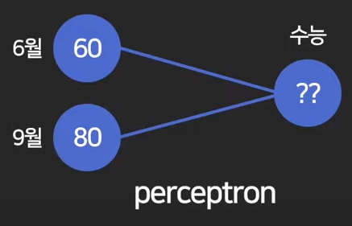

---

### 딥러닝 예시

- 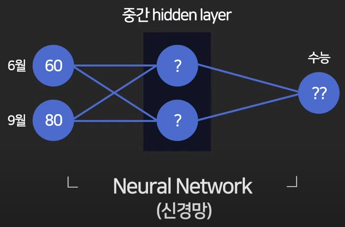
- 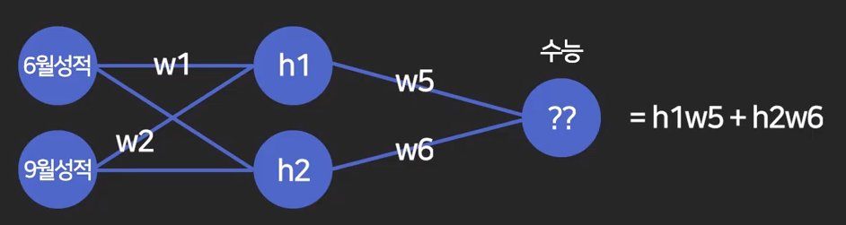
- h : hidden layer
- 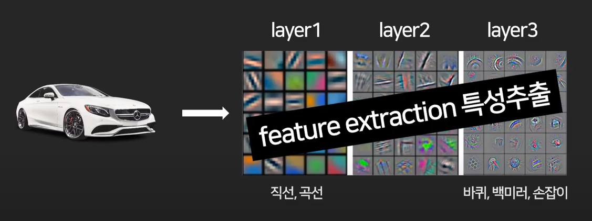
- 전통적인 방식의 머신러닝의 경우 특성 추출을 위해 가이드라인이 필요하다.
- 하지만, 딥 러닝의 경우 hidden layer 가 있는 인공신경망 ( Neural Network )을 이용해 특성을 추출한다.

---

### Loss function

- 모델의 정확도 평가시, 오차를 구하는 수식
- 평균 제곱 오차
  - 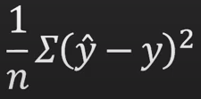
  -  y_hat : 에측값
  - y : 실제값
  - 정수 예측시 사용
- 확률 예측시 사용하는 수식
  - 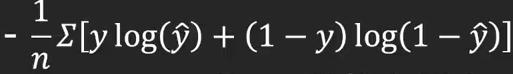

---

### activation function

- 활성함수
- 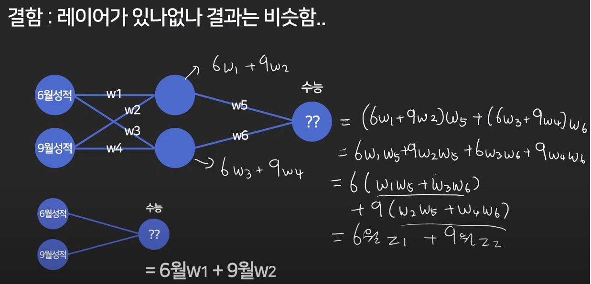
- 이러한 문제를 해결하기위해 활성 함수가 필요함!
- 활성함수없이 예측
  - 선형적이고 단순한 예측
- 활성함수포함한 예측
  - 비선형적이고 복잡한 예측 가능
  - 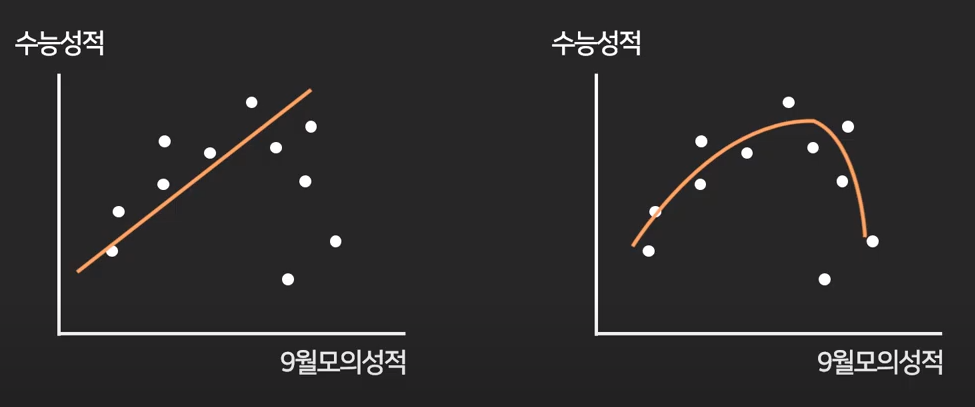
- 활성함수의 종류
  - sigmoid
    - 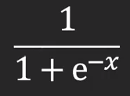
    - 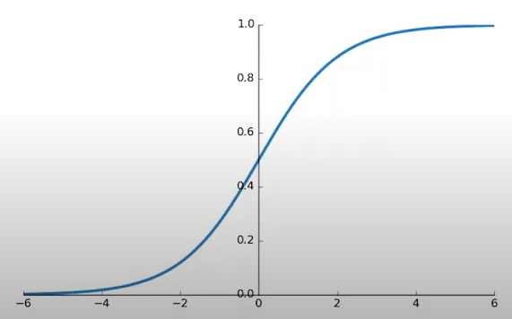
  - Hyperbolic tangent
    - 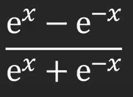
    - 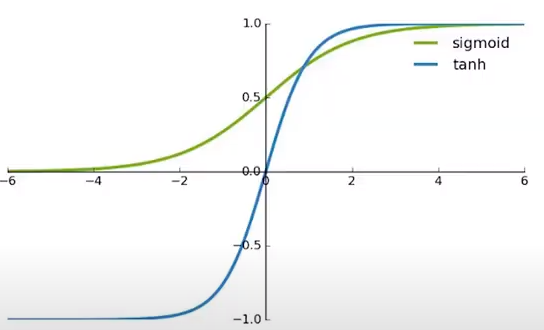
  - Rectified Linear Units
    - 양수면 x 그대로, 음수면 0
    - 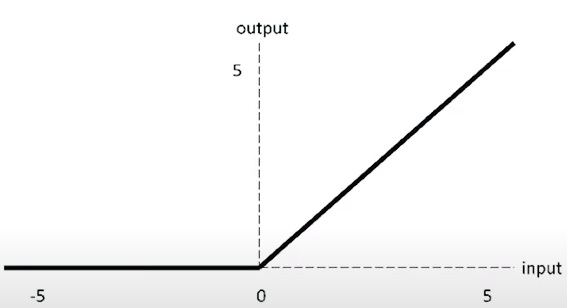

---

### 경사 하강법 Gradient Descent

- 경사 하강법 Gradient Descent
  - 총손실 E를 최소화하는 w를 찾는게 목적입니다.
  - 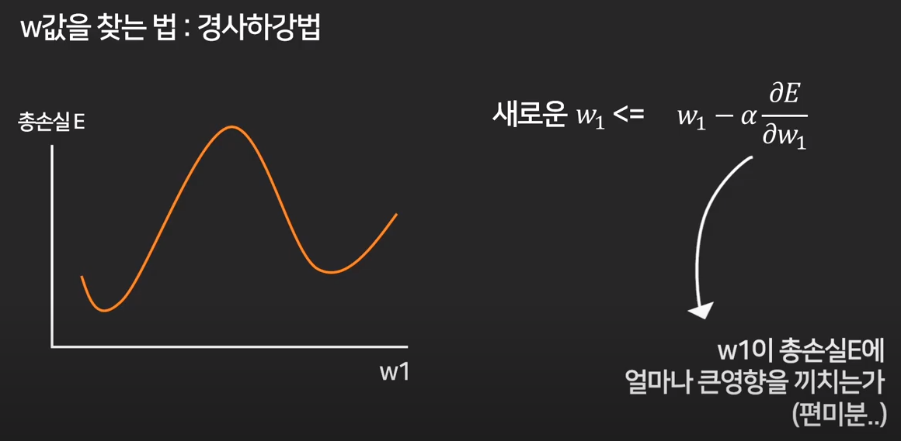
  - 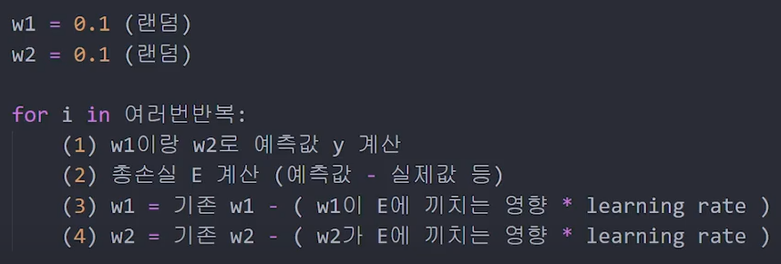
- learning rate
  - Gradient Descent(경사하강법)을 통해 Cost(loss) Function의 최소값을 찾게 되도록 합니다.
  - 극소점 즉, Global Minima에 다다르지 않고, 기울기가 0이 되는 다른 지점을 Local Minima라고 합니다.
  - 이렇게 Local Minima로 빠지는 것을 방지하기 위한 방법으로 다양한 Optimize 기법이 있습니다.
  - 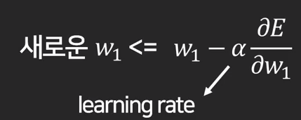
  - 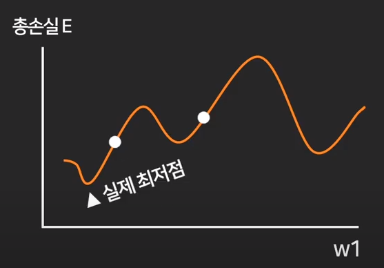
  - 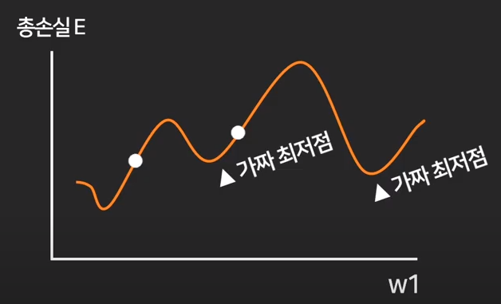
- learning rate optimizer
  - 실험적으로 여러개의 옵티마이저를 써보고 모델과 어울리는것을 택해야 합니다.
  - 보통 Adam이 대부분의 상황에서 잘나옵니다.
  - Momentum
    - 이전에 변화를 기억해서 변화를 유지합니다.
    - 관성, 가속도를 유지
  - AdaGrad
    - 자주 변하는 w는 작게 섬세하게 조절
    - 자주 안변하는 w는 Local Minima에 빠졌을 수 있으니 크게 조절
  - RMSProp
    - AdaGrad 제곱
  - AdaDelta
    - AdaGrad 에서 값이 너무 작아져서 학습안되는것을 방지
  - Adam
    - RMSProp + Momentum

---

### Tensor 자료형 기초

- ```bash
  $ pip install --upgrade pip
  $ pip install tensorflow
  $ pip install pandas
  $ pip install numpy
  ```

- ```python
  import tensorflow as tf
  
  # tensor 생성
  tensor1 = tf.constant([3, 4, 5])
  tensor2 = tf.constant([6, 7, 8])
  tensor3 = tf.constant([[1, 2], [3, 4]])
  
  # 여러줄로 표현도 가능
  tensor4 = tf.constant([[1, 2],
                          [3, 4]])
  
  # 사칙연산
  print(tensor1 + tensor2)
  print(tf.add(tensor1, tensor2))
  print(tensor1 - tensor2)
  print(tf.subtract(tensor1, tensor2))
  print(tensor1 * tensor2)
  print(tf.multiply(tensor1, tensor2))
  print(tensor1 / tensor2)
  print(tf.divide(tensor1, tensor2))
  print(tensor3 * tensor4)
  print(tf.multiply(tensor3, tensor4))
  
  # 행렬 곱셉 연산 / dot product
  print(tf.matmul(tensor3, tensor4))
  
  # 0으로 초기화
  tensor5 = tf.zeros(10)
  print(tensor5)
  tensor6 = tf.zeros( [2, 2] )
  print(tensor6)
  tensor7 = tf.zeros( [2, 2, 3] )
  print(tensor7)
  
  # 모양 확인하기
  print(tensor7.shape)
  
  # tensor의 datatype 확인하기
  tensor8 = tf.constant([1, 2, 3])
  print(tensor8) # dtype=int32
  tensor9 = tf.constant([1.0, 2.0, 3.0])
  print(tensor9) # dtype=float32
  tensor10 = tf.constant([1.0, 2, 3])
  print(tensor10) # dtype=float32
  
  # tensor의 datatype 변환하기
  tensor11 = tf.constant([1, 2, 3], tf.float32)
  print(tensor11)
  print(tf.cast(tensor9, tf.int32))
  tensor12 = tf.constant([1.1, 2.1, 3.1])
  tensor13 = tf.dtypes.cast(tensor12, tf.int32)
  print(tensor13)
  
  # weight
  w1 = tf.Variable(1.0) # dtype=float32
  print(w1)
  print(w1.numpy())
  w1.assign(2) # dtype=float32
  print(w1)
  w2 = tf.Variable(1) # dtype=int32
  print(w2)
  w2.assign(2) # dtype=int32
  print(w2)
  # w2.assign(3.0)
  # TypeError: Cannot convert 3.0 to EagerTensor of dtype int32
  ```

---

### Tensorflow 기초

- 간단한 Linear Regression 선형회귀 예측

- 키 170 신발사이즈 260 예측

- ```python
  import tensorflow as tf
  
  
  # loss(cost) function
  def 손실함수():
      global 신발사이즈, 키, w1, b
      실제값 = 신발사이즈
      예측값 = 키 * w1 + b
      return tf.square(실제값 - 예측값)
  
  
  키 = 170
  신발사이즈 = 260
  
  # weight 가중치
  w1 = tf.Variable(0.1)
  
  # bias 편향
  b = tf.Variable(0.2)
  
  
  # learning rate optimizer
  opt = tf.keras.optimizers.Adam(learning_rate = 0.1)
  
  # 총손실 E를 최소화하는 경사 하강법 Gradient Descent 300회 반복
  for _ in range(300):
      opt.minimize(손실함수, var_list = [w1, b])
      print('weigth =', w1.numpy(), '/ bias =', b.numpy())
  
  최종예측값 = 키 * w1 + b
  실제값 = 신발사이즈
  print('최종예측값 :', 최종예측값.numpy(), '/ 실제값 :', 신발사이즈)
  ```

---


